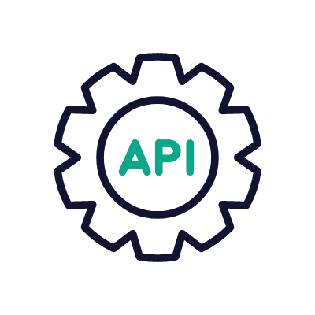

# Tech talk about API's

In this repository, you can find two .md (french.md and english.md).
They are a summary of my API's TechTalk in both languages.

  

## Sources

https://www.redhat.com/fr/topics/api/what-are-application-programming-interfaces

https://www.redhat.com/en/topics/api/what-are-application-programming-interfaces

https://aws.amazon.com/fr/what-is/api/

https://randomuser.me/