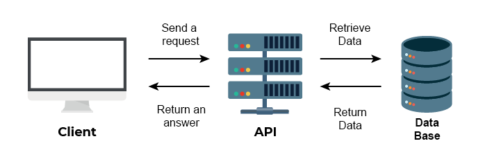
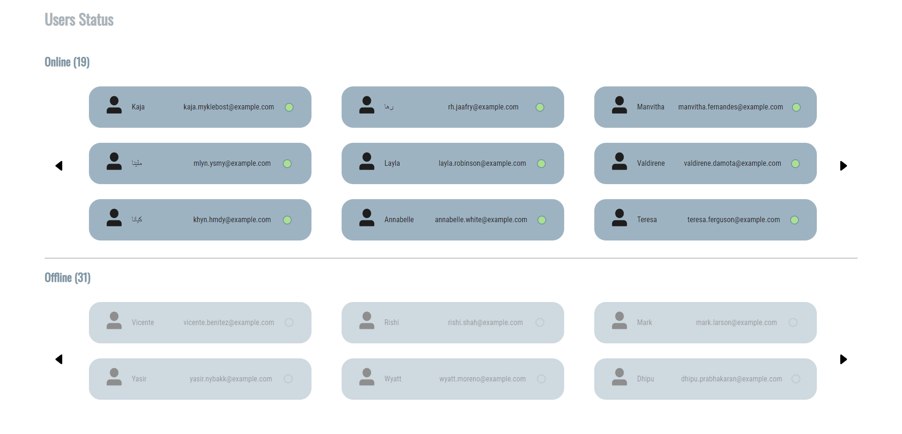

# API's

## What is an API?

An API (application programming interface) is a software interface that "connects" a software or service to another in order to exchange data and functionalities.   They can be free or paid.

## Fonctionnement

Think of an API as a data exchange interface between several systems: the client sends a data request to the server, and the server extracts and collects the data from various sources such as applications, web services, databases, etc... All without knowing the details of their implementation.   They will simplify application development, saving you time and money.

## Different types of API

There are three types of API: private, partner and public.

### Private API

It can only be used internally. This ensures total control over the API.

### Partners API

It is shared with certain company partners (often paying, with an API key). This generates new revenue streams without compromising the security of shared data.

### Public API

It is accessible to all. It then authorizes third parties to develop applications that interact with the API.

## API example

There are many APIs. They're used everywhere (Twitter, Reddit, etc.).   But here I will talk about a free public API that generates fake user data I used for a project.

API link: https://randomuser.me/  
Here is the project for which this API was used: https://taweria.github.io/users-list/

This API generates false user data such as email address, user name, telephone number, etc.  
This is very useful when you need a database but don't have one, and don't have the time to create each user by hand.

### How to use

If you're using jQuery, you can call the API via a $.ajax() function in the javascript file:

<pre>
$.ajax({
  url: 'https://randomuser.me/api/',
  dataType: 'json',
  success: function(data) {
    console.log(data);
  }
})
</pre>

However, companies are trying to stop using jQuery because it's no longer maintained/supported.
I recommend that you create a javascript function with the native fetch function:

<pre>
async function getUsers() {
    const response = await fetch("https://randomuser.me/api/?results=50");

    users   = await response.json();
    users   = users.results;
    loading = false;
    
    users.forEach(user => {
        if (user.gender == 'female') {
            onlineUsers.push(user);
        }
        else {
            offlineUsers.push(user);
        }
    }); 
  </pre>

(This function calls the API and asks it to generate 50 users, then sorts them into female (online) and male (offline)).