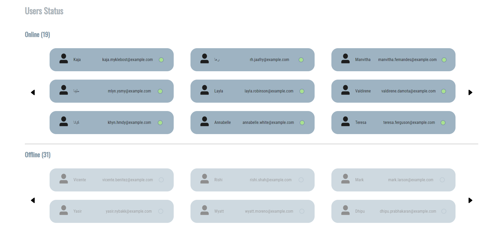

# Les API

## Qu'est-ce qu'une API?

Une API (application programming interface ou  "interface de programmation d’application") est une interface logicielle qui permet de "connecter" un logiciel ou un service à un autre logiciel ou service afin d’échanger des données et des fonctionnalités.   Elles peuvent être gratuites ou payantes.

## Fonctionnement

Il faut considérer l’API comme une interface d’échange de données entre plusieurs systèmes: le client envoie une requête de données au serveur et le serveur va extraire et collecter des données issues des différentes sources comme les applications, web services, bases de données etc…
Tout cela sans connaitre les détails de leur mise en oeuvre.   Elles vont simplifier le développement d'applications et ainsi vous gagnerez du temps et de l'argent.

## Différents types d'API

Il existe trois types d'API: les privées, les partenaires et les publiques.

### API privées

Elle n'est utilisable qu'en interne. Cela permet de garder le controle total sur l'API.

### API partenaires

Elle est partagée avec certains partenaires de l'entreprise (souvent payant, avec une clé d'API). Cela génère de nouveaux flux de revenus sans compromettre la sécurité des données partagées.

### API publiques

Elle est accessible à tous. Elle autorise alors les tiers à développer des applications qui interagissent avec la dite API.

## Exemple d'API

Il existe beaucoup d'API. Elles sont utilisées partout (Twitter, Reddit, etc).   Mais ici je vous parlerai d'une API publique gratuite, générant de fausses données utilisateurs que j'ai utilisé pour un projet.

Lien de l'API: https://randomuser.me/  
Voici le projet pour lequel cette API a été utilisée: https://taweria.github.io/users-list/

Cette API génère donc de fausses donnés utilisateurs telles que l'email, le nom d'utilisateur, le numero de téléphone, etc.  
C'est très pratique lorsqu'on a besoin d'une base de données mais qu'on en a pas et que l'on a pas le temps ou l'envie de créer chaque utilisateur à la main.

### Comment l'utiliser

Si vous utilisez jQuery, vous pourrez appeler l'API via une fonction $.ajax() dans le fichier javascript:

<pre>
$.ajax({
  url: 'https://randomuser.me/api/',
  dataType: 'json',
  success: function(data) {
    console.log(data);
  }
})
</pre>

Mais, dans les entreprises, on essaye de ne plus utiliser le jQuery parce que celui-ci n'est plus maintenu/pris en charge.
Je vous conseille donc plutot de créer une fonction javascript avec la fonction native fetch:

<pre>
async function getUsers() {
    const response = await fetch("https://randomuser.me/api/?results=50");

    users   = await response.json();
    users   = users.results;
    loading = false;
    
    users.forEach(user => {
        if (user.gender == 'female') {
            onlineUsers.push(user);
        }
        else {
            offlineUsers.push(user);
        }
    }); 
  </pre>

  (Cette fonction appele l'API en lui demandant de générer 50 utilisateurs, pour ensuite les trier en femelle (online) et male (offline))
